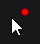
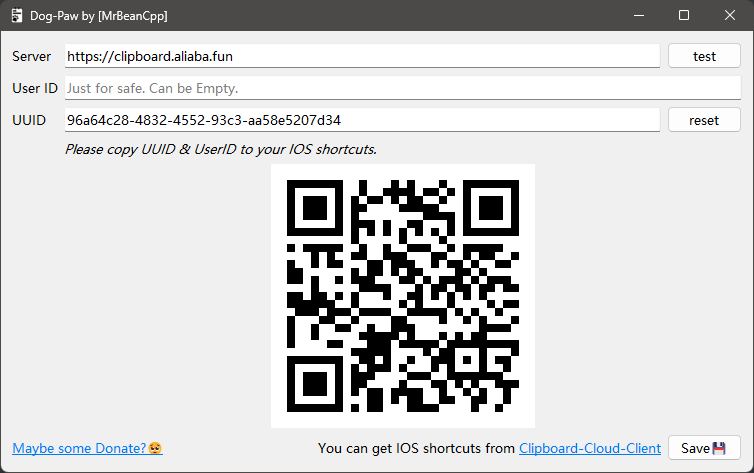
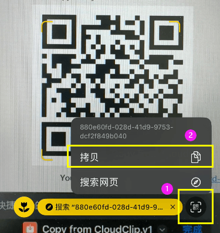
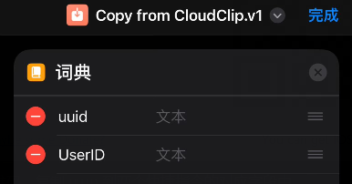
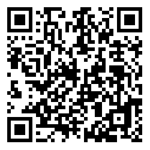
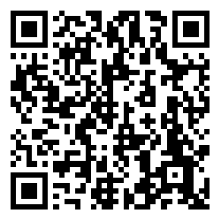
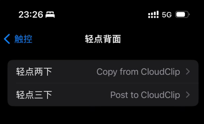
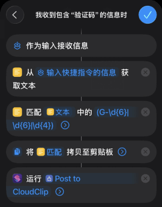

  
  <h1 style="display: inline-block; vertical-align: middle;">Dog-Paw</h1>

Dog-Paw 是一个支持💻`Windows` 和 📱`iOS`/💻︎`MacOS`间共享的云剪贴板

> Dog-Paw: Your friendly, efficient cloud clipboard that 'grabs' and stores data for you.

#### 目前支持的数据格式：

- 文本（Text）
- 图像（Image）

> [!IMPORTANT]
> 默认服务器已迁移至：`https://clipboard.aliaba.fun`

### 特色

- **随处可用**：提供了并发安全的`Java (Springboot)`[后端](https://github.com/MrBeanCpp/Clipboard-Cloud-BE)，用于广域网数据交换

- **隐私保护**：

  - 基于内存的数据模型：不会持久化用户数据（默认2分钟后过期）
  - 定期清理剪切板数据：防止信息泄露
  - 每日动态变化的`ID`：避免私钥泄露 (*TODO*)
  - `SHA256`算法：有效防止哈希碰撞
  - `HTTPS`协议：拒绝中间人攻击
  - 模式切换：可开启`[Receive-Only Mode]`，该模式不会自动监听剪贴板，只接收云端推送
    - 此时，用户可以**单击托盘图标**或在**托盘菜单**中手动推送剪切板

- **良好的人机交互**：

  - `Windows`端上传数据后，会在光标周围显示小红点，提示用户，并在网络故障时，显示为黑点

    

  - `Windows`端接收数据后，会通过气泡通知用户
  - `IOS`端上传与下载均有弹窗通知
  - 网络故障时，会改变托盘图标颜色通知用户

- **清爽的用户体验**：

  - 无需安装`iOS/Mac App`，仅用快捷指令完成
  - 无需登录注册，设定好`UUID` + 个人标识码（`UserID`）后即可使用
    - *`UserID`用于防止小概率的`UUID`碰撞 & 提高安全性，可置空*
    - 🔑 *`ID = SHA256(UUID + UserID)`，请务必确保`Windows`端与`IOS`端`UUID & UserID`一致*

- **高分屏支持**：`Qt`原生高`DPI`缩放方案

- **高效简洁的客户端实现**：`Qt C++`，性能无需多言

### 模型

- 采用 [生产者 - 消费者] 模型，数据被`Get`之后，会从云端**删除**

### 限制

- 目前仅支持单台`Windows` & `iOS/Mac`间数据共享

### To-Do📜

- 未来将支持多设备共享剪贴板
- 重构快捷指令

## 使用方式

1. 在 `Windows` 上运行 `DogPaw.exe`（建议右键托盘图标，选择开机自启动（`AutoStart`））

   

   请用📷相机 or 扫码器扫描该二维码，复制`UUID`到**两个**快捷指令的对应字段中

   

   

   *UserID可为空*

   **※** 🈁然后点击右下角的 **[Save]** ，程序就会开始连接服务器，可通过托盘图标查看连接状态

   - `Ctrl+V`自动复制到云端，并在鼠标右上角显示小红点
   - `iOS`上传数据时，`Windows`端会自动同步，并显示气泡通知

2. `iPhone` or `iPad` 上安装快捷指令

   📷使用相机 or 扫码器即可识别 

   1. ⬇**Copy from Cloud**:(download)
      - iCloud: [https://www.icloud.com/shortcuts/917ee986c6b24e31b414a1d6b840fef0](https://www.icloud.com/shortcuts/917ee986c6b24e31b414a1d6b840fef0)
      - 
   2. ⬆**Post to Cloud**:(upload)
      - iCloud: [https://www.icloud.com/shortcuts/bc14a7b9041a4751afb273afc5554aff](https://www.icloud.com/shortcuts/bc14a7b9041a4751afb273afc5554aff)
      - 

   可以将`Copy from Cloud`设置为**轻点背面两下**，`Post to Cloud`设置为**轻点背面三下**

   

## 更多玩法

### 自动推送验证码

在**PC**中登录网站，发送的**短信验证码**却是**手机**接收的，这着实令人不快

结合`iPhone`**自动化**（快捷指令App），通过`Dog-Paw`，就可以实现短信**验证码自动推送**功能

无需任何操作，验证码自动转发至**PC剪切板**，`Ctrl + V`即可完成登录

#### 原理

通过**iPhone自动化**监听短信接收事件 -> 筛选包含"验证码"关键词的信息 -> 触发快捷指令运行

**自定义快捷指令**：获取短信文本 -> 正则匹配验证码 -> 写入**iPhone**剪切板 -> `Dog-Paw`上传到云 -> **PC**接收并写入剪切板

自动化设置可参考：[验证码快捷指令教程](https://www.vgover.com/news/124843)

## 已知问题

### IOS快捷指令🫨

- 不太好直接区分文本/图像，目前通过拓展名 & 类型判断，可以区分：*txt, rtf, heic, png, jpeg, url*

## 第三方库

- 二维码生成：[nayuki/QR-Code-generator](https://github.com/nayuki/QR-Code-generator)

## 特别鸣谢

- ICON Design：[@pinkyrie](https://github.com/pinkyrie)
